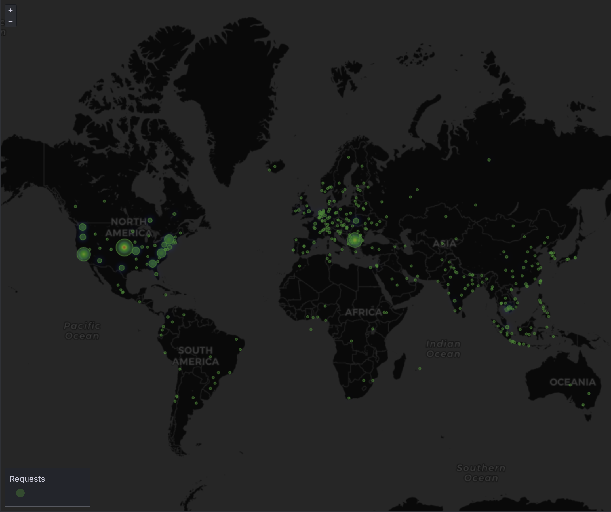
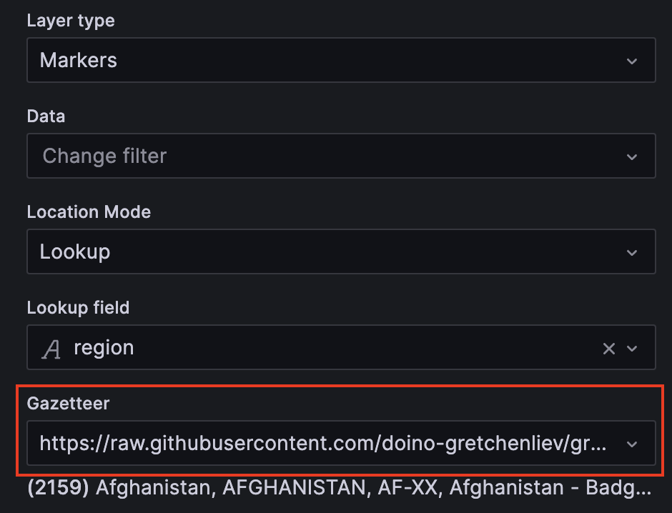

# ISO 3166-1 alpha-2, ISO 3166-1 alpha-3 and ISO 3166-2 subdivisions gazetteer for Grafana



## What is ISO 3166-1 code?

ISO 3166-1 is part of the ISO 3166 standard, which defines codes for the names of countries, dependent territories, and special areas of geographical interest. ISO 3166-1 specifically provides a set of two-letter (alpha-2), three-letter (alpha-3), and numeric country codes.

## What is ISO 3166-2 code?

ISO 3166-2 is a subset of the ISO 3166 standard. It defines codes for the principal subdivisions of all countries coded in ISO 3166-1. These subdivisions can include states, provinces, regions, or other similar entities. The code generally consists of the ISO 3166-1 alpha-2 country code followed by a hyphen and the subdivision code. The format and composition of the subdivision code vary from country to country.

## How is this useful?

Many security systems offer enhanced geographic details through ISO 3166-2 codes. By utilizing these codes, you can achieve more accurate mapping.

## How to use?

You can use this gazetteer directly with Grafana by inserting [the RAW URL](https://raw.githubusercontent.com/doino-gretchenliev/grafana-iso-codes-gazetteer/main/iso.json) into the Gazetter field of the Geomap panel.


You can parse [Amazon AWS WAF logs](https://docs.aws.amazon.com/waf/latest/developerguide/logging.html) using the following query:
```
parse @message /labels.*region:(?<region>.*?)"/
| stats count(*) as requestCount by region
```

## What is the origin of the location data?

Approximately 99% of the location data was obtained from [Wikidata](https://www.wikidata.org/wiki/Wikidata:Main_Page), with the rest being manually curated. The mapping of country codes to Wikidata was derived from various sources, also involving manual curation.

## What's the coverage?

|Level|Gazetteer|Total(according to Wikipedia)|
|---|---|---|
|Country|250|242|
|Subdivision|5366|5043|

In this gazetteer, some legacy codes are retained to enhance system compatibility.

## May I contribute or extend the project?

Of course! The [generation script](generator.py) is available in this repository, as well as the source [countries](countries.json) and [subdivisions](subdivisions.json) files.